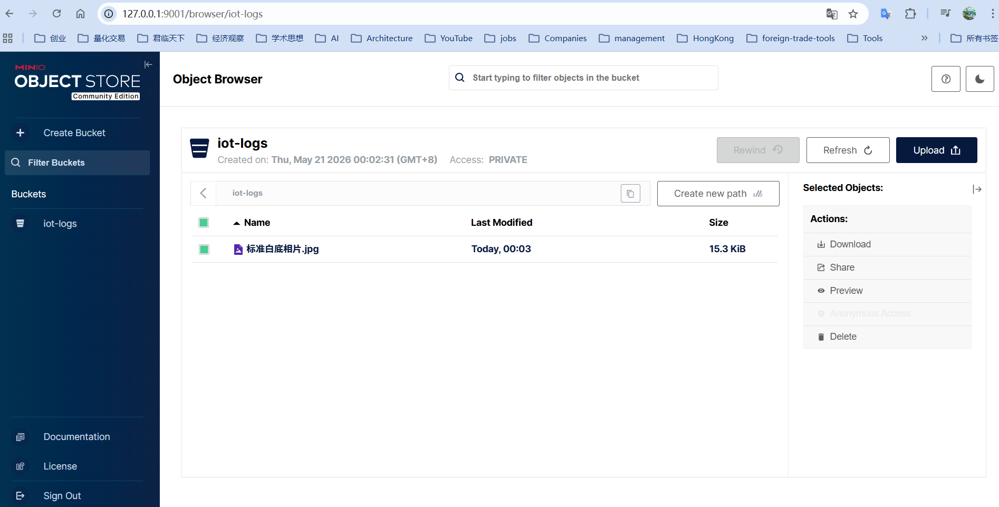

# Minio

MinIO在物联网领域扮演着数据基础设施核心的角色。它通过"边缘存储+中心聚合"的架构，解决了物联网海量非结构化数据（如视频、传感器日志、图像）的采集、存储、处理与智能分析难题

# 核心驱动力：为什么是MinIO？
物联网数据的特点是量大、种类多（非结构化）、实时性强。传统存储要么太贵，要么太慢，要么不适合在资源有限的边缘端部署。MinIO恰好用三个特性解决了这些问题：

轻量与高性能的完美结合：MinIO整个服务仅约40-100MB，单进程即可运行，非常适合部署在资源有限的边缘网关或基站侧。但它的性能却极其强悍，在标准硬件上可达171GB/s的写入速度，单节点（4核8G）可稳定支撑2000+ QPS，能满足边缘端高并发的数据写入需求。

为云原生和AI时代设计：它与Kubernetes等容器编排平台集成得非常好，方便在边缘和云端统一部署和管理。同时，作为AI数据管道的理想存储底座，MinIO能高效地为AI模型训练提供海量数据支持，从车联网到智能制造，这是它被广泛采用的关键。

可靠且经济的数据保护：采用纠删码（Erasure Code） 技术，在同等存储容量下，其数据冗余的成本远低于传统的多副本方案。这对于需要长期保存海量数据的物联网场景来说，性价比极高。

# 四大核心应用场景
MinIO在物联网领域的应用已经非常深入和具体：

场景分类	具体应用实例	核心价值与工作方式
边缘数据湖	工业产线、环境监测、智慧城市	在边缘侧就近存储和分析原始数据，再将处理后的关键数据或原始数据回传至中心，构建高效的分层数据湖，避免海量原始数据全部回传造成的网络拥堵。
视频监控与安防	智慧交通、工厂安防、零售监控	在本地直接写入多路高码率视频流，并能通过策略控制回传带宽，既保证了视频数据的完整留存，又避免了占用过多中心带宽。
工业物联网与车联网	自动驾驶、车队管理、预测性维护	作为车载或产线边缘节点的数据采集站，就地存储传感器、摄像头等数据，支持实时分析与关键数据筛选上传，从而支撑远程诊断、合规审计以及AI模型训练。
5G/6G 边缘计算	5G基站、XR（扩展现实）应用	作为小型边缘数据中心的核心存储，为低延迟应用提供就近的数据存取服务，处理用户面数据和遥测信息，经学术研究验证其在5G网络中的性能和加密效率优于传统方案。
一个典型的例子是，全球领先的自动驾驶汽车制造商正在使用MinIO，将车辆收集的海量数据安全、高效地传回中心的"AI工厂"，用于训练和优化其自动驾驶模型。

# 架构与未来：从边缘到AI工厂
MinIO的物联网策略通常采用"云边协同"的分层架构：

边缘层：在靠近设备的地方部署单机MinIO，负责数据的实时写入、短期缓存和初步处理。

中心云层：在数据中心或云端部署MinIO分布式集群，汇聚来自所有边缘节点的数据，作为统一的数据湖，支撑大数据分析和AI模型训练。

这个架构让MinIO自然地成为了从边缘计算到AI工厂的桥梁。随着边缘AI的发展，在边缘侧直接对数据进行处理和推理的需求日益增长，MinIO正逐步成为支撑这一模式的关键数据底座。

# 部署路径建议
在实际落地时，可以采取分步走的策略：

边缘起步：先在边缘节点以单机模式部署MinIO，快速实现本地数据存储。利用其S3 API和丰富的SDK，与现有的设备采集程序（如Fluentd）轻松集成。

中心扩展：当数据量和并发需求上来后，再在中心节点搭建分布式MinIO集群，通过配置生命周期策略和复制规则，实现数据的自动分层、迁移和统一管理。

MinIO凭借其轻量、高性能、云原生以及对AI的友好性，已成为物联网尤其是边缘计算场景下不可或缺的存储组件。它不仅能充当数据仓库，更是驱动AI应用持续进化的数据引擎。


# 运行minio模块

## 构建镜像

```
docker-compose down
docker-compose build --no-cache
docker-compose up -d
```

## 运行容器

linux
```bash
docker run -d \
--name minio \
-p 9000:9000 \
-p 9001:9001 \
-v /data/minio/data:/data \
-e "MINIO_ROOT_USER=minioadmin" \
-e "MINIO_ROOT_PASSWORD=minioadmin" \
minio/minio:RELEASE.2025-04-22T22-12-26Z \
server /data --console-address ":9001"
```


windows
```bash
docker run -d --name minio -p 9000:9000 -p 9001:9001 -v D:/minio/data:/data -e "MINIO_ROOT_USER=minioadmin" -e "MINIO_ROOT_PASSWORD=minioadmin" minio/minio server /data --console-address ":9001"
```

# 测试方法

```bash
curl -X POST -F "file=@test.png" http://localhost:8080/api/files/upload

```

# 测试结果




- 9000 服务器地址
- 9001 webUI地址
- 图片对象访问地址
```
http://127.0.0.1:9001/api/v1/download-shared-object/aHR0cDovLzEyNy4wLjAuMTo5MDAwL2lvdC1sb2dzLyVFNiVBMCU4NyVFNSU4NyU4NiVFNyU5OSVCRCVFNSVCQSU5NSVFNyU5QiVCOCVFNyU4OSU4Ny5qcGc_WC1BbXotQWxnb3JpdGhtPUFXUzQtSE1BQy1TSEEyNTYmWC1BbXotQ3JlZGVudGlhbD1XUlowTEZUQ0xLWkMwRjAxMzJHOCUyRjIwMjYwNTIwJTJGdXMtZWFzdC0xJTJGczMlMkZhd3M0X3JlcXVlc3QmWC1BbXotRGF0ZT0yMDI2MDUyMFQxNjA3MDNaJlgtQW16LUV4cGlyZXM9NDMxOTgmWC1BbXotU2VjdXJpdHktVG9rZW49ZXlKaGJHY2lPaUpJVXpVeE1pSXNJblI1Y0NJNklrcFhWQ0o5LmV5SmhZMk5sYzNOTFpYa2lPaUpYVWxvd1RFWlVRMHhMV2tNd1JqQXhNekpIT0NJc0ltVjRjQ0k2TVRjM09UTXpOakE1Tnl3aWNHRnlaVzUwSWpvaWJXbHVhVzloWkcxcGJpSjkuNWtwMmtsS0J1TEZOYS1fY0Z0cl8zbUt4ZTUyMFE3dm1wQ1FNM3JTR0lVY1huRXFIQl9iTnp0NDVxS3FDS0ZsLU5UNFJmeUVjbXVjRW83NmVpQWtibVEmWC1BbXotU2lnbmVkSGVhZGVycz1ob3N0JnZlcnNpb25JZD1udWxsJlgtQW16LVNpZ25hdHVyZT01ZDljMTM0YTcwMjgwZDY1OWNlYzAxZjQ3MDI0MjZlODcwMTU4OGJlMTFiMDY1Yzg1MDdlZWZkNDc3MDFkZTNl
```